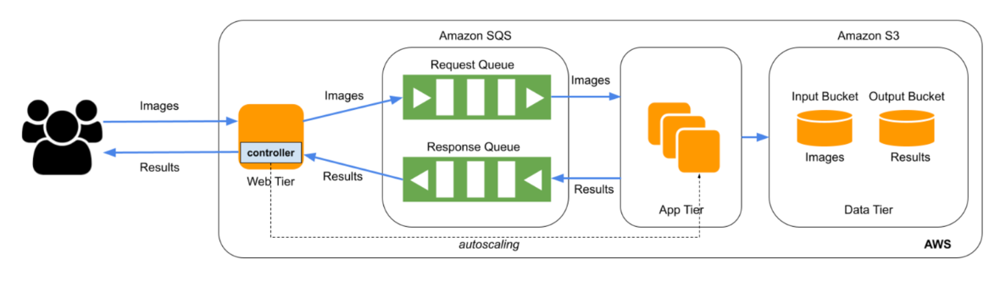

# Face Recognition as a Service
Cloud application which provides Face Recognition as a Service to the users by using the resources of the AWS cloud.

## Architecture

## Web Tier
It loads the user input images to the SQS request queue and S3 input bucket and the load balancer manages the auto scaling with the help of the same SQS

## App Tier
It hosts the provided deep learning model, processes the image and sends it back to a S3 output bucket and a SQS response queue. The App Tier also constantly checks the input queue for any messages. If there are none, it terminates itself to scale down the instances.

